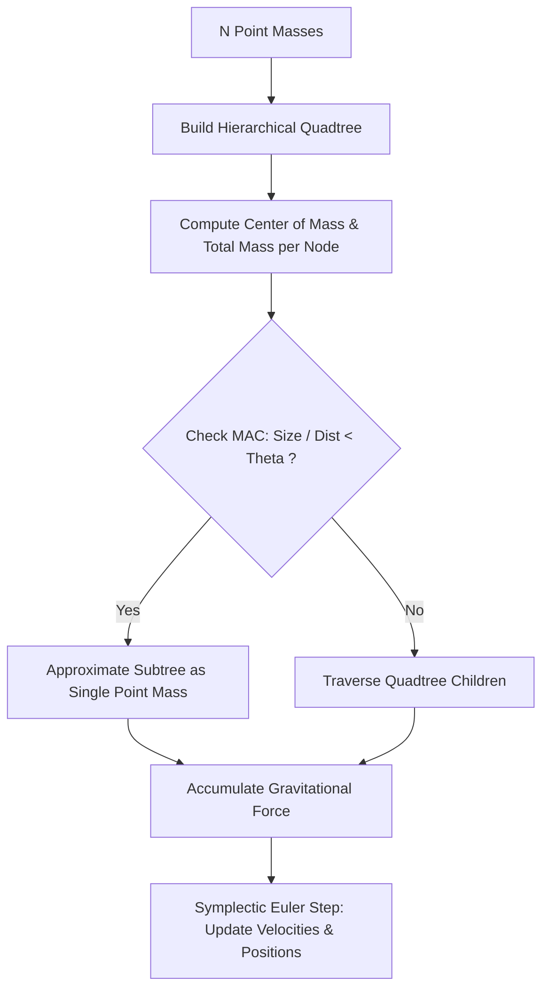

# genpark-barnes-hut-nbody-gravity-simulation-skill

Agent Skill implementing the **Barnes-Hut $O(N \log N)$ hierarchical quadtree algorithm** for gravitational N-body simulations with Multipole Acceptance Criteria (MAC).

## Architectural Overview

